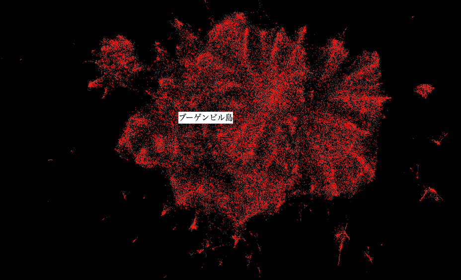
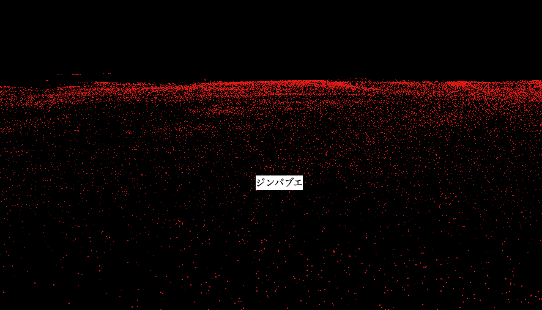

# Million Plot




An example of [three.js particle system](https://threejs.org/examples/?=interactive#webgl_interactive_points) for easy visualization of feature vectors and its metadata (Up to roughly 3 million points with MacBookPro 2019). In this example, feature vectors of a word2vec model was used with its words as metadata ([UMAP](https://arxiv.org/abs/1802.03426)-compressed [Japanese word2vec model](http://www.cl.ecei.tohoku.ac.jp/~m-suzuki/jawiki_vector/)) Replace ./data/data.module.js to visualize your data.

./data/data.module.js
```
var Data = [];
Data.ws = ["dog", "cat", ... "bird"];
Data.vs = [[10.32, 42.234], [54.234, 44.463], ... [23.532, 23.432]];
export {Data}
```

ws = words
vs = vectors

words and vectors must be corresponding. e.g. the point of "dog" appears at (x, y) = (10.32, 42.234) on the example above. The label appears with mouse hover.

# Why?
You can easily create interactive visualization systems for feature vectors . For simple visualization purpose, consider using [Embedding Projector](https://projector.tensorflow.org/). For more advanced visualization, see [Arts & Culture Experiment](https://artsexperiments.withgoogle.com/freefall).